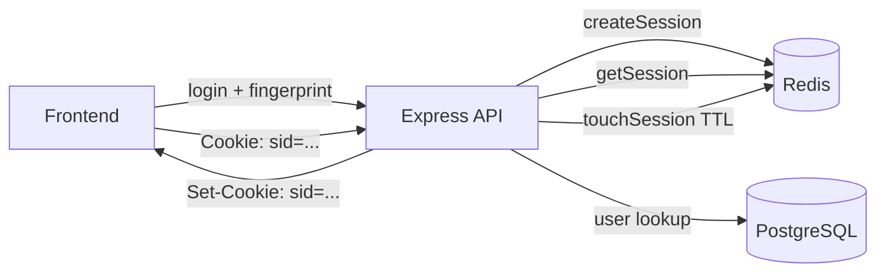

Here is the documentation in the same format as [`documentation.md`](documentation.md). Copy everything below the line into the file:

---

# Authentication System — Session-Based Auth with Redis

This document describes the work done to implement a complete session-based
authentication system using Redis for session storage, including auth routes,
controllers, middleware, validation, and an integration test suite.

---

## 1. Overview

The authentication system provides:

- **Session-based auth** with opaque session IDs stored in Redis (not JWTs).
- **Universal login** across three roles: `student`, `teacher`, `admin`.
- **Student device binding** — max 2 permanent device slots per student,
  enforced by DB constraints.
- **Password reset** flow with hashed, single-use, expiring tokens.
- **Signed cookies** via `cookie-parser` with `SESSION_COOKIE_SECRET`.
- **Sliding session expiration** — TTL refreshed on every authenticated request.
- **Structured error responses** with machine-readable `code` fields.
- **Integration test suite** with vitest + supertest.

### Architecture



Sessions are opaque `randomBytes(32).toString('base64url')` IDs — they carry no
claims and can be revoked instantly by deleting the Redis key.

---

## 2. Environment Configuration

Added the following variables to the Zod env schema in [`env.ts`](env.ts:48):

| Variable | Type | Default | Purpose |
|---|---|---|---|
| `REDIS_URL` | `string` | `redis://127.0.0.1:6379` | Redis connection string |
| `SESSION_TTL_SECONDS` | `number` | `604800` (7 days) | Session TTL in Redis + cookie maxAge |
| `SESSION_COOKIE_NAME` | `string` | `sid` | Name of the session cookie |
| `SESSION_COOKIE_SECRET` | `string` (min 16) | — | Secret for signing cookies |
| `PASSWORD_RESET_TTL_MINUTES` | `number` | `30` | Password reset token expiry |
| `APP_BASE_URL` | `string` | `http://localhost:3000` | Base URL for email links |

The test environment ([`.env.test`](.env.test:7)) was updated with matching
values plus `CORS_ORIGIN`.

---

## 3. Redis Client

Created [`src/db/redis.ts`](src/db/redis.ts:5) — a Redis client singleton using
`ioredis`.

Key design decisions:

- Uses `@epic-web/remember` in non-production to preserve the connection
  across HMR reloads (same pattern as the DB pool in
  [`src/db/connection.ts`](src/db/connection.ts:7)).
- In production, creates a direct client.
- `maxRetriesPerRequest: 3` prevents indefinite hanging on connection loss.
- `enableReadyCheck: true` ensures commands wait until the connection is ready.

```ts
export const redis = isProd()
  ? createRedisClient()
  : remember('redisClient', () => createRedisClient())
```

---

## 4. AppError — Structured Error Class

Created [`src/utils/AppError.ts`](src/utils/AppError.ts:7) — an `Error`
subclass carrying an HTTP `status` and a machine-readable `code`.

Static factory methods:

| Method | Status | Default code |
|---|---|---|
| [`AppError.badRequest()`](src/utils/AppError.ts:26) | 400 | (caller provides) |
| [`AppError.unauthorized()`](src/utils/AppError.ts:30) | 401 | `UNAUTHORIZED` |
| [`AppError.forbidden()`](src/utils/AppError.ts:34) | 403 | `FORBIDDEN` |
| [`AppError.notFound()`](src/utils/AppError.ts:38) | 404 | `NOT_FOUND` |
| [`AppError.conflict()`](src/utils/AppError.ts:42) | 409 | (caller provides) |

`Object.setPrototypeOf(this, AppError.prototype)` is called in the constructor
so `instanceof` works correctly after transpilation.

---

## 5. Token Utilities

Created [`src/utils/tokens.ts`](src/utils/tokens.ts:1) with three functions:

- [`generateTokenPair()`](src/utils/tokens.ts:7) — generates a 32-byte random
  opaque token (base64url) and returns both the raw token (sent to the user)
  and its SHA-256 hash (stored in the DB). Raw tokens are never persisted.
- [`hashToken()`](src/utils/tokens.ts:14) — SHA-256 hex digest of a token
  string.
- [`safeEqual()`](src/utils/tokens.ts:19) — constant-time comparison of two
  hex digests using `timingSafeEqual`, preventing timing attacks on token
  verification.

---

## 6. Session Service

Created [`src/services/sessionService.ts`](src/services/sessionService.ts:1) —
the Redis session CRUD layer.

### Redis key layout

| Key pattern | Type | Purpose |
|---|---|---|
| `session:<sessionId>` | string (JSON) | The session payload |
| `session:user:<userId>` | set | Index of session IDs for a user (bulk revocation) |

### Functions

| Function | Description |
|---|---|
| [`createSession()`](src/services/sessionService.ts:16) | Generates a 32-byte session ID, stores the session JSON with TTL, adds to the user index set |
| [`getSession()`](src/services/sessionService.ts:44) | Reads + deserializes a session; returns `null` if missing/expired |
| [`touchSession()`](src/services/sessionService.ts:60) | Refreshes the sliding TTL (called on every authenticated request) |
| [`destroySession()`](src/services/sessionService.ts:65) | Deletes a single session + removes from user index (logout) |
| [`destroyAllUserSessions()`](src/services/sessionService.ts:76) | Deletes all sessions for a user via pipeline (password reset) |
| [`sessionCookieOptions()`](src/services/sessionService.ts:86) | Returns cookie options: `httpOnly`, `secure` in prod, `sameSite: 'lax'`, `path: '/'` |

---

## 7. Email Service

Created [`src/services/emailService.ts`](src/services/emailService.ts:20) with
[`sendPasswordResetEmail()`](src/services/emailService.ts:20) — a thin
abstraction so the auth controller stays decoupled from the email transport.
In development/test it logs the reset link; in production it integrates with the
email provider.

---

## 8. Auth Types

Modified [`src/types/authTypes.ts`](src/types/authTypes.ts:1) to add:

- [`UserRole`](src/types/authTypes.ts:3) — `'admin' | 'teacher' | 'student'`
  union.
- [`SessionUser`](src/types/authTypes.ts:9) — the minimal role-agnostic user
  object stored in the session (`id`, `role`, `name`, `email`). Kept small to
  avoid stale data and keep session payloads light.
- [`SessionData`](src/types/authTypes.ts:19) — the full session payload in
  Redis (`user`, `deviceId?`, `expiresAt`, `createdAt`).
- [`AuthenticatedRequest`](src/types/authTypes.ts:29) — extends Express
  `Request` with optional `user`, `sessionId`, `session`, and `deviceId` fields
  populated by the auth middleware.

---

## 9. Auth Middleware

Modified [`src/middleware/authMiddleware.ts`](src/middleware/authMiddleware.ts:1):

### [`authenticate`](src/middleware/authMiddleware.ts:12)

The core session middleware. On every request it:

1. Reads the signed session ID from `req.cookies[SESSION_COOKIE_NAME]`.
2. Returns `401 NO_SESSION` if no cookie is present.
3. Loads the session from Redis via [`getSession()`](src/services/sessionService.ts:44).
4. Returns `401 SESSION_EXPIRED` if the session is missing/invalid.
5. Attaches `req.sessionId`, `req.session`, `req.user`, and `req.deviceId`.
6. Refreshes the sliding TTL via [`touchSession()`](src/services/sessionService.ts:60).

### [`requireRole(...roles)`](src/middleware/authMiddleware.ts:48)

A guard factory that checks `req.user.role` against the allowed roles. Returns
`401` if not authenticated, `403 ROLE_FORBIDDEN` if the role doesn't match.

### [`authenticateToken`](src/middleware/authMiddleware.ts:64)

Backwards-compatible alias for `authenticate`.

---

## 10. Validation Middleware

Modified [`src/middleware/validation.ts`](src/middleware/validation.ts:1) to
add [`validate()`](src/middleware/validation.ts:83) — a combined validator for
wrapped Zod schemas of the form:

```ts
z.object({ body: ..., params: ..., query: ... })
```

Each section is optional; only the provided ones are validated. On failure it
returns `400` with:

```json
{
  "success": false,
  "error": {
    "code": "VALIDATION_ERROR",
    "message": "Validation failed",
    "details": [{ "field": "email", "message": "..." }]
  }
}
```

The existing `validateBody`, `validateParams`, and `validateQuery` functions
were left untouched.

---

## 11. Error Handler

Modified [`src/middleware/errorHandler.ts`](src/middleware/errorHandler.ts:11)
to:

- Detect `AppError` instances via `instanceof` and emit their structured
  `code`/`message`/`details`.
- Emit a consistent `{ success: false, error: { code, message, details? } }`
  shape for all errors.
- Include `stack` in development (`APP_STAGE === 'dev'`).
- Set `code = 'NOT_FOUND'` in the [`notFound`](src/middleware/errorHandler.ts:69)
  handler.

---

## 12. Auth Validations (Zod Schemas)

Created [`src/validations/authValidation.ts`](src/validations/authValidation.ts:1)
with shared field schemas and endpoint-specific wrapped schemas:

| Schema | Endpoint | Key fields |
|---|---|---|
| [`registerSchema`](src/validations/authValidation.ts:19) | `POST /auth/register` | `name` (2–120), `email`, `password` (8–128) |
| [`loginSchema`](src/validations/authValidation.ts:30) | `POST /auth/login` | `email`, `password`, `device_fingerprint?` (regex `^sha256:.+$`), `device_label?` |
| [`passwordResetRequestSchema`](src/validations/authValidation.ts:43) | `POST /auth/password-reset-request` | `email` |
| [`passwordResetSchema`](src/validations/authValidation.ts:52) | `POST /auth/password-reset` | `token`, `password` (8–128) |
| [`deviceIdParamSchema`](src/validations/authValidation.ts:80) | `DELETE /auth/devices/:id` | `id` (UUID) |

The `device_fingerprint` field enforces the `sha256:<hash>` format via regex,
matching the frontend fingerprint generation approach.

---

## 13. Auth Controllers

Created [`src/controllers/authController.ts`](src/controllers/authController.ts:1)
with the following handlers and helpers.

### Helpers

- [`toSessionUser()`](src/controllers/authController.ts:36) — builds the
  role-agnostic `SessionUser` from a DB row.
- [`findUserByEmail()`](src/controllers/authController.ts:50) — looks up a user
  across `students`, `teachers`, and `admins` **sequentially with
  short-circuit** evaluation. Stops as soon as a match is found. This avoids
  two unnecessary queries on the common path (students are the most frequent
  role) and is resilient to transient connection errors on a single table.
- [`resolveStudentDevice()`](src/controllers/authController.ts:92) — the device
  binding logic:
  1. If the fingerprint already exists (active) → reuse it, refresh
     `lastSeenAt`.
  2. If it's new and a free slot exists → bind to slot 1 or 2.
  3. If both slots are full → throws `403 DEVICE_LIMIT_REACHED`.

  The `UNIQUE(student_id, slot_number)` constraint guarantees no race produces
  a duplicate slot. The limit is defined by
  `MAX_DEVICES_PER_STUDENT = 2`.

### Endpoints

| Handler | Route | Description |
|---|---|---|
| [`register`](src/controllers/authController.ts:159) | `POST /auth/register` | Student sign-up. Checks for duplicate email (`409 EMAIL_TAKEN`), hashes password, inserts student, returns `201` with user data. |
| [`login`](src/controllers/authController.ts:212) | `POST /auth/login` | Universal login. Looks up user, verifies password (`401 INVALID_CREDENTIALS`), checks `isActive` (`403 ACCOUNT_DISABLED`), binds device for students, creates Redis session, sets signed cookie, returns `200` with user + `expires_at`. |
| [`logout`](src/controllers/authController.ts:285) | `POST /auth/logout` | Destroys the Redis session, clears the cookie, returns `200`. |
| [`me`](src/controllers/authController.ts:298) | `GET /auth/me` | Returns the current `req.user` from the session. |
| [`passwordResetRequest()`](src/controllers/authController.ts:303) | `POST /auth/password-reset-request` | Always returns `200` (no email enumeration). If the student exists, generates a token pair, stores the hash, and emails the reset link. |
| [`passwordReset`](src/controllers/authController.ts:341) | `POST /auth/password-reset` | Validates the token (hash + `safeEqual` + expiry + not-used), updates the password in a transaction, marks the token as used, destroys all user sessions. |
| [`listDevices`](src/controllers/authController.ts:475) | `GET /auth/devices` | Lists the student's bound devices. (Route later moved to students routes.) |

### Security measures

- **No user enumeration**: `login` returns the same `INVALID_CREDENTIALS` for
  wrong password and non-existent email. `password-reset-request` always
  returns `200`.
- **Token hashing**: raw tokens are never stored; only SHA-256 hashes.
- **Constant-time comparison**: [`safeEqual()`](src/utils/tokens.ts:19)
  prevents timing attacks.
- **Single-use tokens**: marked `usedAt` instead of deleted (audit trail).
- **Session invalidation on password reset**:
  [`destroyAllUserSessions()`](src/services/sessionService.ts:76) kills all
  active sessions.

---

## 14. Auth Routes

Modified [`src/routes/v1/authRoutes.ts`](src/routes/v1/authRoutes.ts:1) to wire
the controllers with validation middleware:

| Method | Path | Middleware | Handler |
|---|---|---|---|
| POST | `/register` | `validate(registerSchema)` | `register` |
| POST | `/login` | `validate(loginSchema)` | `login` |
| POST | `/password-reset-request` | `validate(passwordResetRequestSchema)` | `passwordResetRequest` |
| POST | `/password-reset` | `validate(passwordResetSchema)` | `passwordReset` |
| POST | `/logout` | `authenticate` | `logout` |
| GET | `/me` | `authenticate` | `me` |

---

## 15. Central Route Registry

Created [`src/routes/index.ts`](src/routes/index.ts:1) — a central route
registry so `server.ts` only mounts a single router and all API versioning is
managed in one place:

```ts
const router = Router()
const v1 = Router()
v1.use('/auth', authRoutes)
router.use('/v1', v1)
```

New versions (`v2`, ...) and feature routers (`studentRoutes`, `teacherRoutes`)
can be added here without touching `server.ts`.

---

## 16. Server Integration

Modified [`src/server.ts`](src/server.ts:1):

- Added `cookieParser(env.SESSION_COOKIE_SECRET)` to parse signed cookies.
- Mounted the central route registry.

---

## 17. Testing Setup

### 17.1 Configuration

Modified [`vitest.config.ts`](vitest.config.ts:1):

- Set `testTimeout: 30_000` and `hookTimeout: 30_000` — the remote Neon test DB
  is slow over SSL.
- Configured `globalSetup` to point at the setup file.
- `singleThread: true` to avoid database conflicts.

### 17.2 Global Setup

Created [`tests/setup/globalSetup.ts`](tests/setup/globalSetup.ts:14):

- Creates all auth-related tables with `IF NOT EXISTS` (idempotent).
- Creates the `student_devices` table with its `CHECK`, `UNIQUE`, and index
  constraints.
- Flushes Redis so tests start clean.
- Returns an async teardown function that closes the Redis connection and DB
  pool so the process exits cleanly.

### 17.3 Test App Helper

Created [`tests/helpers/app.ts`](tests/helpers/app.ts:1):

- [`resetAuthState()`](tests/helpers/app.ts:27) — `TRUNCATE ... RESTART
  IDENTITY CASCADE` on auth tables + `redis.flushdb()` between tests for
  isolation.
- [`api()`](tests/helpers/app.ts:44) — returns a `supertest.agent(app)` for
  cookie-preserving request flows.
- [`loginAs()`](tests/helpers/app.ts:53) — performs a login and extracts the
  `Set-Cookie` header manually (supertest's agent doesn't reliably replay
  signed cookies across requests).
- [`cookieHeader()`](tests/helpers/app.ts:97) — builds a `{ Cookie: ... }`
  header object from a raw cookie string.
- [`combineCookies()`](tests/helpers/app.ts:89) — parses raw `Set-Cookie`
  entries and combines `name=value` pairs into a single `Cookie` header value.

### 17.4 Factory Helpers

Created [`tests/helpers/factories.ts`](tests/helpers/factories.ts:1):

- [`createStudent()`](tests/helpers/factories.ts:18) — inserts a student with a
  hashed password. Supports `isActive` and `emailVerified` overrides.
- [`createTeacher()`](tests/helpers/factories.ts:47) — inserts a teacher
  (requires an `adminId` for the FK).
- [`createAdmin()`](tests/helpers/factories.ts:68) — inserts an admin.
- [`fingerprint()`](tests/helpers/factories.ts:87) — generates a valid
  `sha256:<hex>` device fingerprint string from a seed.
- [`TestUser`](tests/helpers/factories.ts:5) — interface returned by all
  factories, carrying `id`, `name`, `email`, `role`, and the plaintext
  `password` for login assertions.

### 17.5 Test Suite

Created [`tests/auth/authRoutes.test.ts`](tests/auth/authRoutes.test.ts:21) —
integration tests covering:

**Register** (3 tests):

- Creates a student and returns 201
- Rejects duplicate email with 409 `EMAIL_TAKEN`
- Rejects invalid input with 400 `VALIDATION_ERROR`

**Login** (9 tests):

- Logs in a student and sets a session cookie
- Logs in a teacher without `device_fingerprint`
- Logs in an admin without `device_fingerprint`
- Returns 401 `INVALID_CREDENTIALS` for wrong password
- Returns 401 for non-existent email (no enumeration)
- Requires `device_fingerprint` for students
- Reuses existing device slot on repeat login (same fingerprint)
- Binds a second device to slot 2
- Returns 403 `DEVICE_LIMIT_REACHED` when 2 slots are full
- Blocks disabled student accounts with 403 `ACCOUNT_DISABLED`

**Authenticated endpoints** (3 tests):

- `GET /auth/me` returns the logged-in user
- `GET /auth/me` returns 401 without a session
- `POST /auth/logout` destroys the session and clears the cookie

**Password reset** (4 tests):

- `password-reset-request` always returns success (no enumeration)
- `password-reset` consumes a valid token and updates the password
- `password-reset` rejects an invalid token
- `password-reset` rejects an expired token

---

## 18. Frontend Device Fingerprint

The frontend should generate a device fingerprint using the **Web Crypto API**
(SHA-256) and persist it in `localStorage` so it remains stable across sessions
on the same browser:

1. Collect browser signals (userAgent, language, screen dimensions, timezone,
   platform).
2. Concatenate them into a single string.
3. Hash with `crypto.subtle.digest('SHA-256', ...)`.
4. Prefix with `sha256:` to match the backend regex `^sha256:.+$`.
5. Store in `localStorage` under a key like `device_fingerprint`.
6. Send as `device_fingerprint` in the login request body.

This is a **fingerprint**, not a secret — it identifies the device, not the
user. It does not need to be cryptographically random; it needs to be
**stable** and **unique per browser**.