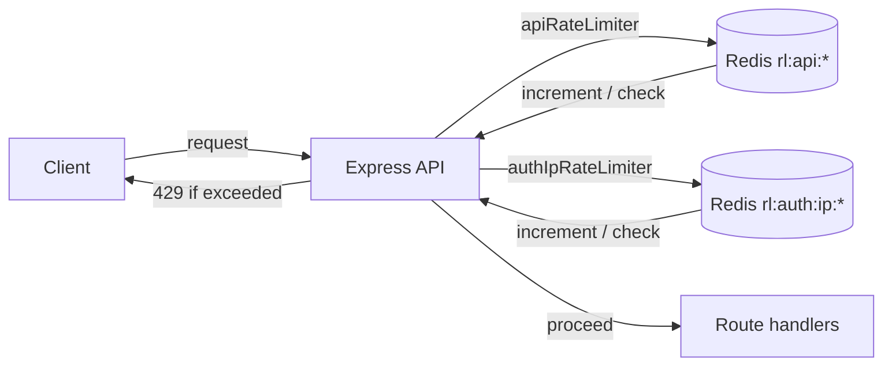

Here is the documentation in the same format as [`documentation.md`](documentation.md). Copy everything below the line into the file:

---

# Rate Limiting — Redis-Backed Request Throttling

This document describes the work done to add distributed, Redis-backed rate
limiting to the API using `express-rate-limit` with a `rate-limit-redis` store
bridged to the existing `ioredis` client. It covers the new middleware, the
environment variables, and how the limiters are wired into the server and the
auth routes.

---

## 1. Overview

The rate-limiting layer provides:

- **Distributed throttling** — hit counters live in Redis (not in-process
  memory), so the limits are enforced consistently across multiple app
  instances behind a load balancer.
- **Two tiers of limits**:
  - A **general API limiter** applied to every incoming request.
  - A **stricter auth limiter** applied to authentication endpoints
    (`register`, `login`, `password-reset-*`) to mitigate brute-force and
    credential-stuffing attacks.
- **Standardized rate-limit headers** (`RateLimit-*`, IETF draft-7) and
  disabled legacy `X-RateLimit-*` headers.
- **Consistent error shape** — rate-limited responses use the project's
  existing `{ success: false, error: { code, message } }` contract with HTTP
  `429`.
- **Test-friendly** — both limiters are skipped in the `test` stage so the
  integration suite can exercise endpoints without being throttled.

### Architecture



Both stores reuse the same `ioredis` connection used for sessions
([`src/db/redis.ts`](src/db/redis.ts:1)), so no additional Redis client is
created.

---

## 2. Dependencies

Added to [`package.json`](package.json:1):

| Package | Version | Purpose |
|---|---|---|
| `express-rate-limit` | `^8.5.2` | The rate-limiting middleware factory |
| `rate-limit-redis` | `^5.0.0` | A `Store` implementation for `express-rate-limit` that sends raw Redis commands |

`rate-limit-redis` does not bundle its own Redis client — it only needs a
function capable of sending raw commands. The existing `ioredis` client
exposes exactly that via [`redis.call()`](src/db/redis.ts:1), so the two are
bridged together (see §4).

---

## 3. Environment Configuration

Added four validated, coercible variables to the Zod env schema in
[`env.ts`](env.ts:34). All have sensible defaults, so existing `.env` files
keep working without changes.

| Variable | Type | Default | Purpose |
|---|---|---|---|
| [`RATE_LIMIT_WINDOW_MS`](env.ts:35) | `number` (positive) | `900000` (15 min) | Window size for the general API limiter |
| [`RATE_LIMIT_MAX_REQUESTS`](env.ts:36) | `number` (positive) | `100` | Max requests per window per IP for the general limiter |
| [`RATE_LIMIT_AUTH_WINDOW_MS`](env.ts:37) | `number` (positive) | `900000` (15 min) | Window size for the auth limiter |
| [`RATE_LIMIT_AUTH_MAX_REQUESTS`](env.ts:38) | `number` (positive) | `10` | Max auth attempts per window per IP |

```ts
// Rate limiting (backed by Redis via ioredis)
RATE_LIMIT_WINDOW_MS: z.coerce.number().positive().default(15 * 60 * 1000), // 15 min
RATE_LIMIT_MAX_REQUESTS: z.coerce.number().positive().default(100),
RATE_LIMIT_AUTH_WINDOW_MS: z.coerce.number().positive().default(15 * 60 * 1000), // 15 min
RATE_LIMIT_AUTH_MAX_REQUESTS: z.coerce.number().positive().default(10),
```

The development [`.env`](.env:11) already declares `RATE_LIMIT_WINDOW_MS` and
`RATE_LIMIT_MAX_REQUESTS`; the two auth-specific variables fall back to their
defaults when absent.

---

## 4. Rate Limiter Middleware

Created [`src/middleware/rateLimiter.ts`](src/middleware/rateLimiter.ts:1) —
the single source of both limiters and the Redis store factory.

### 4.1 `createRedisStore(prefix)`

[`createRedisStore()`](src/middleware/rateLimiter.ts:7) builds a
`rate-limit-redis` `RedisStore` wired to the shared `ioredis` client.

`rate-limit-redis`'s `RedisStore` accepts a `sendCommand` function of the form
`(...args: string[]) => Promise<RedisReply>`, where the first argument is the
command name and the rest are its arguments. `ioredis` exposes raw command
sending through [`redis.call(command, ...args)`](src/db/redis.ts:1), so the
bridge is a one-liner:

```ts
const createRedisStore = (prefix: string) =>
  new RedisStore({
    sendCommand: (...args: string[]) =>
      redis.call(args[0], ...args.slice(1)) as Promise<RedisReply>,
    prefix,
    resetExpiryOnChange: true,
  })
```

- `prefix` namespaces the Redis keys (`rl:api:` / `rl:auth:ip:`) so the
  counters never collide with session keys or each other.
- `resetExpiryOnChange: true` refreshes the key's TTL whenever its hit count
  changes, implementing a **fixed-window** counter per key.

### 4.2 `rateLimitResponse(code, message)`

[`rateLimitResponse()`](src/middleware/rateLimiter.ts:16) is a small factory
that returns a `RateLimitExceededEventHandler` emitting the project's standard
error shape with HTTP `429`:

```ts
const rateLimitResponse = (code: string, message: string): RateLimitExceededEventHandler =>
  (_req: Request, res: Response) => {
    res.status(429).json({
      success: false,
      error: { code, message },
    })
  }
```

This keeps rate-limit responses uniform with the rest of the API (see
[`src/middleware/errorHandler.ts`](src/middleware/errorHandler.ts:11)).

### 4.3 `apiRateLimiter` — General API Limiter

[`apiRateLimiter`](src/middleware/rateLimiter.ts:24) is applied globally to
every request.

| Option | Value | Rationale |
|---|---|---|
| `store` | `createRedisStore('rl:api:')` | Distributed counter in Redis |
| `windowMs` | `env.RATE_LIMIT_WINDOW_MS` | Configurable window (default 15 min) |
| `limit` | `env.RATE_LIMIT_MAX_REQUESTS` | Configurable ceiling (default 100) |
| `standardHeaders` | `'draft-7'` | Emit `RateLimit-*` headers |
| `legacyHeaders` | `false` | Suppress `X-RateLimit-*` headers |
| `passOnStoreError` | `true` | **Fail open** — let requests through if Redis is down |
| `skip` | `() => isTest()` | Disabled in the test stage |
| `handler` | `rateLimitResponse('RATE_LIMIT_EXCEEDED', ...)` | Standard `429` body |

Failing open for the general limiter is intentional: a Redis outage should not
take the whole API offline.

### 4.4 `authIpRateLimiter` — Auth Endpoint Limiter

[`authIpRateLimiter`](src/middleware/rateLimiter.ts:39) is a stricter limiter
applied to authentication endpoints.

| Option | Value | Rationale |
|---|---|---|
| `store` | `createRedisStore('rl:auth:ip:')` | Separate namespace from the API limiter |
| `windowMs` | `env.RATE_LIMIT_AUTH_WINDOW_MS` | Configurable window (default 15 min) |
| `limit` | `env.RATE_LIMIT_AUTH_MAX_REQUESTS` | Low ceiling (default 10) — brute-force mitigation |
| `standardHeaders` | `'draft-7'` | Emit `RateLimit-*` headers |
| `legacyHeaders` | `false` | Suppress `X-RateLimit-*` headers |
| `passOnStoreError` | `false` | **Fail closed** — block auth requests if Redis is down |
| `skip` | `() => isTest()` | Disabled in the test stage |
| `keyGenerator` | `ipKeyGenerator(req.ip)` | Key strictly on the client IP |
| `handler` | `rateLimitResponse('AUTH_RATE_LIMIT_EXCEEDED', ...)` | Standard `429` body |

Key differences from the general limiter:

- **Much lower ceiling** (10 vs 100) because auth endpoints are the primary
  brute-force / credential-stuffing target.
- **Fails closed** (`passOnStoreError: false`) — if the store is unavailable,
  auth requests are rejected rather than allowed through, since unthrottled
  auth is a security risk.
- **IP-keyed** via `ipKeyGenerator` from `express-rate-limit`, which applies
  IPv6 subnet normalization so clients behind the same /64 are grouped.

---

## 5. Server Integration

Modified [`src/server.ts`](src/server.ts:1) to mount the general limiter
globally. It runs after body parsing and logging, but before the routes and
the `/health` check:

```ts
import { apiRateLimiter } from './middleware/rateLimiter.ts'
// ...
// Global rate limiter (Redis-backed). Skipped in the test stage so the
// suite can exercise endpoints without being throttled.
app.use(apiRateLimiter)
```

The import is at [`src/server.ts`](src/server.ts:8) and the mount is at
[`src/server.ts`](src/server.ts:30). Because it is registered before
`app.use('/', routes)`, every route — including `/health` — is subject to the
general limit.

---

## 6. Auth Routes Integration

Modified [`src/routes/v1/authRoutes.ts`](src/routes/v1/authRoutes.ts:1) to
apply `authIpRateLimiter` to the public authentication endpoints, ahead of
validation and the controller:

```ts
import { authIpRateLimiter } from '../../middleware/rateLimiter.ts'
// ...
router.post('/register', authIpRateLimiter, validate(registerSchema), register)
router.post('/login', authIpRateLimiter, validate(loginSchema), login)
router.post('/password-reset-request', authIpRateLimiter, validate(passwordResetRequestSchema), passwordResetRequest)
router.post('/password-reset', authIpRateLimiter, validate(passwordResetSchema), passwordReset)
```

The limiter is placed **first** in each route's middleware chain so throttled
requests are rejected before any validation or database work is performed.
Authenticated endpoints (`/logout`, `/me`) are intentionally **not** covered by
the auth limiter — they are already protected by the session check and the
general API limiter.

| Method | Path | Middleware chain |
|---|---|---|
| POST | `/register` | `authIpRateLimiter` → `validate(registerSchema)` → `register` |
| POST | `/login` | `authIpRateLimiter` → `validate(loginSchema)` → `login` |
| POST | `/password-reset-request` | `authIpRateLimiter` → `validate(passwordResetRequestSchema)` → `passwordResetRequest` |
| POST | `/password-reset` | `authIpRateLimiter` → `validate(passwordResetSchema)` → `passwordReset` |

---

## 7. Redis Key Layout

All rate-limit state is stored in the same Redis instance as sessions, under
dedicated prefixes:

| Key pattern | Type | Purpose |
|---|---|---|
| `rl:api:<ip>` | string (counter) | General API hit count for an IP |
| `rl:auth:ip:<ip>` | string (counter) | Auth endpoint hit count for an IP |

Each key carries a TTL equal to its `windowMs`, set via
`resetExpiryOnChange`. When the TTL elapses with no further hits, the counter
expires naturally and the client gets a fresh window.

Because these keys live alongside `session:*` keys, the existing
[`redis.flushdb()`](tests/helpers/app.ts:27) call in the test reset helper
clears them too — though the limiters are skipped in tests anyway.

---

## 8. Design Decisions & Security

- **Redis over in-memory**: `express-rate-limit` defaults to a `MemoryStore`,
  which is per-process. With multiple instances, a client could rotate between
  instances and bypass the limit. Storing counters in Redis makes the limit
  global.
- **Reuse the existing client**: rather than creating a second Redis
  connection, the store bridges to the singleton `ioredis` client from
  [`src/db/redis.ts`](src/db/redis.ts:1), keeping connection count low.
- **Two tiers**: a lenient global limiter protects the API broadly, while a
  strict auth limiter focuses on the highest-risk endpoints. This avoids
  throttling legitimate API usage while still blunting credential attacks.
- **Fail-open vs fail-closed**: the general limiter fails open (availability
  over strictness); the auth limiter fails closed (security over
  availability). This matches the risk profile of each surface.
- **Standard headers**: `RateLimit-*` draft-7 headers let well-behaved
  clients back off proactively; legacy headers are disabled to avoid
  duplicate/confusing headers.
- **Test isolation**: `skip: () => isTest()` ensures the integration suite
  (which makes many rapid requests to the same endpoints) is never throttled,
  keeping tests deterministic and fast.

---

## 9. Response Format

When a client exceeds a limit, the response is HTTP `429` with the standard
error envelope:

```json
{
  "success": false,
  "error": {
    "code": "RATE_LIMIT_EXCEEDED",
    "message": "Too many requests, please try again later."
  }
}
```

For auth endpoints, the code is `AUTH_RATE_LIMIT_EXCEEDED` with the message
`Too many authentication attempts from this network, please try again later.`

The response also includes standard `RateLimit-*` headers, e.g.:

```
RateLimit-Policy: 100;w=900
RateLimit: limit=100, remaining=0, reset=542
```
