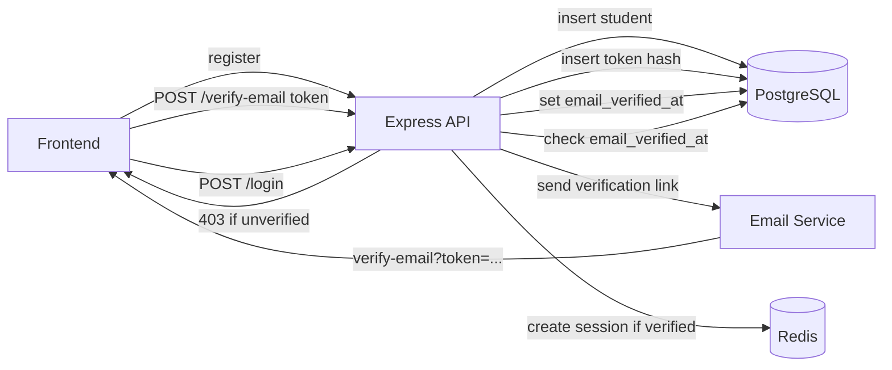

Here is the documentation in the same format as [`documentation.md`](documentation.md). Copy everything below the line into the file:

---

# Email Verification — Hard Gate at Login

This document describes the work done to add an email-verification flow to the
authentication system. Students must confirm ownership of their email address
before they can use the platform. Verification is enforced as a **hard gate at
login**: no session is created for an unverified student, so unverified
accounts cannot reach any authenticated endpoint. The verification state is
**not** stored in the session — it is read from the `students.email_verified_at`
column at login time, keeping the session payload unchanged and the gate
authoritative.

---

## 1. Overview

The email-verification layer provides:

- **Hard login gate** — students with a `NULL` `email_verified_at` are rejected
  with `403 EMAIL_NOT_VERIFIED` before any session or device binding is created.
- **Token-based verification** — a single-use, hashed, expiring token is issued
  at registration and emailed to the student.
- **Resend endpoint** — a student who lost the original link can request a fresh
  one without re-registering.
- **No session changes** — the verification flag lives only in the database, so
  the existing `SessionUser` / `SessionData` shapes are untouched.
- **No user enumeration** — `resend-verification` always returns `200` with the
  same message, regardless of whether the email exists or is already verified.
- **Reuses existing security primitives** — the same `generateTokenPair()`,
  `hashToken()`, and `safeEqual()` utilities that power password reset also
  power verification, ensuring consistent token-handling guarantees.

### Architecture



The gate is evaluated **after** password verification and the active-account
check, but **before** device binding and session creation. This ordering ensures
that an unverified student never consumes a device slot or gets a session.

---

## 2. Environment Configuration

Added one validated, coercible variable to the Zod env schema in
[`env.ts`](env.ts:56):

| Variable | Type | Default | Purpose |
|---|---|---|---|
| `EMAIL_VERIFICATION_TTL_MINUTES` | `number` (positive) | `1440` (24h) | Expiry window for verification tokens |

```ts
// Email verification
EMAIL_VERIFICATION_TTL_MINUTES: z.coerce.number().positive().default(60 * 24), // 24h
```

It has a sensible default, so existing `.env` files keep working without
changes. The value is consumed by the `register` and `resendVerification`
controllers when computing each token's `expiresAt`.

---

## 3. Database Schema

Modified [`src/db/schema.ts`](src/db/schema.ts:141) to add the
`email_verification_tokens` table, its relation, and its inferred type.

### 3.1 `emailVerificationTokens` table

[`emailVerificationTokens`](src/db/schema.ts:142) mirrors the shape of
`password_reset_tokens` — single-use, hashed, expiring tokens scoped to a
student:

| Column | Drizzle type | Constraints |
|---|---|---|
| `id` | `uuid('id')` | `primaryKey().defaultRandom()` |
| `student_id` | `uuid('student_id')` | `notNull()`, FK → `students.id` `ON DELETE CASCADE` |
| `token_hash` | `text('token_hash')` | `notNull()` |
| `expires_at` | `timestamp('expires_at', { withTimezone: true })` | `notNull()` |
| `used_at` | `timestamp('used_at', { withTimezone: true })` | nullable (set on consumption) |
| `created_at` | `timestamp('created_at', { withTimezone: true })` | `defaultNow().notNull()` |

The table carries a single index:

```ts
(t) => [index('idx_email_verify_student').on(t.studentId)]
```

Design notes:

- **Raw tokens are never stored.** Only the SHA-256 hash (`token_hash`) is
  persisted, exactly as with password-reset tokens.
- **`ON DELETE CASCADE`** ensures a student deletion cleans up their
  verification tokens automatically.
- **`used_at` instead of deletion** — consumed tokens are marked used rather
  than deleted, preserving an audit trail and preventing reuse.
- The existing `students.email_verified_at` column (already present in the
  schema) is the source of truth for the verified state; no boolean flag was
  added.

### 3.2 Relations

Added [`emailVerificationTokensRelations`](src/db/schema.ts) wiring the table
back to `students`, and added a `many(emailVerificationTokens)` entry to the
existing [`studentsRelations`](src/db/schema.ts) so Drizzle's relational query
API can navigate the link in both directions.

### 3.3 Inferred Type

Exported the inferred select type alongside the other table types:

```ts
export type EmailVerificationToken = typeof emailVerificationTokens.$inferSelect
```

---

## 4. Email Service

Modified [`src/services/emailService.ts`](src/services/emailService.ts:50) to add
[`sendEmailVerificationEmail()`](src/services/emailService.ts:50) — a thin
transport abstraction mirroring the existing
[`sendPasswordResetEmail()`](src/services/emailService.ts:20).

```ts
export const sendEmailVerificationEmail = async (
  to: string,
  verifyUrl: string
): Promise<void> => { ... }
```

Behavior:

- **Production** — sends via the Resend provider using the same template and
  `verification_url` variable as the password-reset email, then logs the link.
- **Development/test** — logs the verification link to the console so the token
  is visible without a real email round-trip.

Keeping this as a separate function (rather than parameterizing
`sendPasswordResetEmail`) preserves a clean seam for swapping in a distinct
verification template later without touching the reset flow.

---

## 5. Auth Validations (Zod Schemas)

Modified [`src/validations/authValidation.ts`](src/validations/authValidation.ts:62)
to add two wrapped schemas for the new endpoints:

| Schema | Endpoint | Key fields |
|---|---|---|
| [`verifyEmailSchema`](src/validations/authValidation.ts:62) | `POST /auth/verify-email` | `token` (non-empty string) |
| [`resendVerificationSchema`](src/validations/authValidation.ts:71) | `POST /auth/resend-verification` | `email` (reuses the shared `emailField`) |

Both reuse the existing shared field schemas (`emailField`) so validation rules
stay consistent with the rest of the auth surface.

---

## 6. Auth Controllers

Modified [`src/controllers/authController.ts`](src/controllers/authController.ts:1)
in three places: the `register` handler, the `login` handler, and two new
handlers.

### 6.1 `register` — issue verification token

The [`register`](src/controllers/authController.ts:159) handler was extended.
After inserting the student, it now:

1. Generates a token pair via [`generateTokenPair()`](src/utils/tokens.ts:7).
2. Computes `expiresAt` from `env.EMAIL_VERIFICATION_TTL_MINUTES`.
3. Inserts the `tokenHash` into `email_verification_tokens`.
4. Builds `${APP_BASE_URL}/verify-email?token=${token}` and emails it via
   [`sendEmailVerificationEmail()`](src/services/emailService.ts:50).

The token-issuance block is wrapped in a `try/catch` that logs and continues.
A failure to send the email **must not** roll back the registration — the
student can always request a new link via `/resend-verification`. The response
shape (`201` with the created user) is unchanged.

### 6.2 `login` — hard verification gate

The [`login`](src/controllers/authController.ts:212) handler gained a hard gate
immediately after the active-account check and before device binding:

```ts
// Hard gate: students must verify their email before they can use the app.
if (user.role === 'student') {
  const [row] = await db
    .select({ emailVerifiedAt: students.emailVerifiedAt })
    .from(students)
    .where(eq(students.id, user.id))
    .limit(1)
  if (row && !row.emailVerifiedAt) {
    throw AppError.forbidden(
      'EMAIL_NOT_VERIFIED',
      'Please verify your email address before logging in'
    )
  }
}
```

Key points:

- **Scoped to students.** Teachers are created by admins and admins are
  trusted, so the gate only applies to self-registering students.
- **Reads from the DB, not the session.** Because the verified state is fetched
  fresh at login, there is no stale-session risk and no need to store an
  `isEmailVerified` flag in `SessionUser`.
- **Fails before side effects.** Because it runs before
  [`resolveStudentDevice()`](src/controllers/authController.ts) and
  [`createSession()`](src/services/sessionService.ts:16), an unverified student
  never consumes a device slot or receives a session cookie.
- **Distinct error code.** `EMAIL_NOT_VERIFIED` lets the frontend route the
  user to the verification/resend UI rather than treating it as a generic
  auth failure.

### 6.3 `verifyEmail` — consume token

[`verifyEmail`](src/controllers/authController.ts:391) validates and consumes a
verification token:

1. Hashes the incoming `token` with [`hashToken()`](src/utils/tokens.ts:14).
2. Looks up the row by `tokenHash`.
3. Rejects with `400 INVALID_OR_EXPIRED_TOKEN` if the row is missing, already
   used, fails a [`safeEqual()`](src/utils/tokens.ts:19) constant-time check, or
   is expired.
4. In a single transaction:
   - Sets `students.email_verified_at = now()` and refreshes `updatedAt`.
   - Marks the token row `used_at = now()` (prevents reuse, keeps audit trail).
5. Returns `200` with a success message.

### 6.4 `resendVerification` — issue a fresh link

[`resendVerification`](src/controllers/authController.ts:436) re-issues a
verification link:

1. Looks up the student by email, selecting `emailVerifiedAt`.
2. **Only** if the student exists **and** is unverified, generates a fresh token
   pair, inserts it, and emails the link.
3. **Always** returns `200` with the same generic message, regardless of whether
   the email exists or is already verified — preventing email enumeration.

This mirrors the no-enumeration contract already established by
[`passwordResetRequest()`](src/controllers/authController.ts).

---

## 7. Auth Routes

Modified [`src/routes/v1/authRoutes.ts`](src/routes/v1/authRoutes.ts:1) to wire
the two new public endpoints with the same middleware chain as the other auth
endpoints — the strict `authIpRateLimiter` first, then validation, then the
handler:

```ts
router.post('/verify-email', authIpRateLimiter, validate(verifyEmailSchema), verifyEmail)
router.post('/resend-verification', authIpRateLimiter, validate(resendVerificationSchema), resendVerification)
```

The limiter runs first so throttled requests are rejected before any validation
or database work. The updated route table:

| Method | Path | Middleware chain |
|---|---|---|
| POST | `/register` | `authIpRateLimiter` → `validate(registerSchema)` → `register` |
| POST | `/login` | `authIpRateLimiter` → `validate(loginSchema)` → `login` |
| POST | `/password-reset-request` | `authIpRateLimiter` → `validate(passwordResetRequestSchema)` → `passwordResetRequest` |
| POST | `/password-reset` | `authIpRateLimiter` → `validate(passwordResetSchema)` → `passwordReset` |
| POST | `/verify-email` | `authIpRateLimiter` → `validate(verifyEmailSchema)` → `verifyEmail` |
| POST | `/resend-verification` | `authIpRateLimiter` → `validate(resendVerificationSchema)` → `resendVerification` |
| POST | `/logout` | `authenticate` → `logout` |
| GET | `/me` | `authenticate` → `me` |

---

## 8. Design Decisions & Security

- **Hard gate over soft gate.** Rather than allowing unverified students to log
  in with a limited session (a "soft" gate), login is refused outright. This
  guarantees no authenticated endpoint is reachable by an unverified account and
  avoids a parallel set of "verified-only" middleware.
- **DB as source of truth, not the session.** Storing `email_verified_at` on the
  student row (and reading it at login) means the gate cannot be bypassed by a
  stale or tampered session. The session payload is left untouched, so existing
  session code needs no changes.
- **Token reuse of existing primitives.** Verification tokens use the exact same
  `generateTokenPair()` / `hashToken()` / `safeEqual()` pipeline as password
  reset, inheriting the same guarantees: raw tokens never persisted,
  constant-time comparison, single-use via `used_at`.
- **No enumeration.** `resend-verification` returns an identical `200` response
  for known-unknown and verified-unverified cases, matching the
  `password-reset-request` contract.
- **Resilient registration.** Email-send failures during registration are
  caught and logged; they do not roll back the student row, because the student
  can self-recover via `/resend-verification`.
- **Audit trail.** Consumed tokens are marked `used_at` rather than deleted,
  preserving a history of verification attempts.
- **Rate-limited.** Both new endpoints sit behind `authIpRateLimiter`, so
  token-guessing and resend-abuse are throttled at the IP level.

---

## 9. Response Formats

### 9.1 Unverified login attempt

```json
{
  "success": false,
  "error": {
    "code": "EMAIL_NOT_VERIFIED",
    "message": "Please verify your email address before logging in"
  }
}
```

HTTP `403`.

### 9.2 Successful verification

```json
{
  "success": true,
  "data": {
    "message": "Email verified successfully. You can now log in."
  }
}
```

HTTP `200`.

### 9.3 Invalid / expired / reused token

```json
{
  "success": false,
  "error": {
    "code": "INVALID_OR_EXPIRED_TOKEN",
    "message": "The verification token is invalid or has expired"
  }
}
```

HTTP `400`.

### 9.4 Resend verification

```json
{
  "success": true,
  "data": {
    "message": "If an account exists for that email and is unverified, a verification link has been sent."
  }
}
```

HTTP `200` — identical whether or not the email exists or is already verified.

---

## 10. Testing

### 10.1 Global Setup

Modified [`tests/setup/globalSetup.ts`](tests/setup/globalSetup.ts:62) to create
the `email_verification_tokens` table (idempotent `IF NOT EXISTS`) plus its
`idx_email_verify_student` index, so the integration suite has the table
available without running a migration.

### 10.2 Test Reset Helper

Modified [`tests/helpers/app.ts`](tests/helpers/app.ts:14) to add
`email_verification_tokens` to the `AUTH_TABLES` list used by
[`resetAuthState()`](tests/helpers/app.ts:27), so the table is truncated between
tests for isolation.

### 10.3 Factory Helper

Modified [`tests/helpers/factories.ts`](tests/helpers/factories.ts:18) so
[`createStudent()`](tests/helpers/factories.ts:18) accepts an `emailVerified`
override and sets `email_verified_at` to `now()` by default. This keeps the
existing login tests passing (they assume a usable student) while letting
verification-specific tests opt into an unverified student via
`createStudent({ emailVerified: false })`.

### 10.4 Test Suite

Added an **Email verification** `describe` block to
[`tests/auth/authRoutes.test.ts`](tests/auth/authRoutes.test.ts) covering:

- `POST /auth/register` issues a verification token row.
- `POST /auth/login` blocks unverified students with `403 EMAIL_NOT_VERIFIED`.
- `POST /auth/verify-email` consumes a valid token, marks the email verified,
  and unblocks login.
- `POST /auth/verify-email` rejects an invalid token with
  `INVALID_OR_EXPIRED_TOKEN`.
- `POST /auth/verify-email` rejects an expired token.
- `POST /auth/verify-email` rejects a reused (already-consumed) token.
- `POST /auth/resend-verification` always returns success (no enumeration) and
  only creates a token row for a known, unverified student.
- `POST /auth/resend-verification` does not send for an already-verified
  student (no token row created).

The existing register test was also updated to assert that a verification token
row is created at sign-up.
